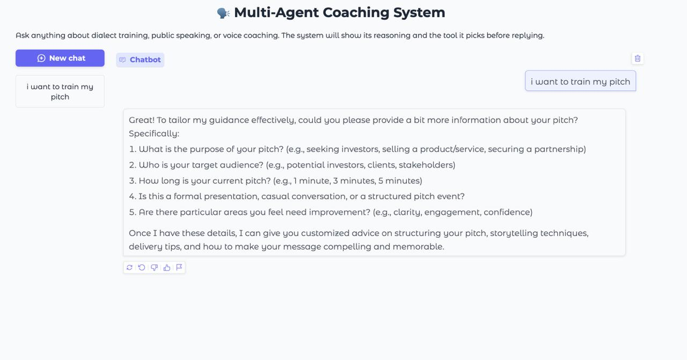

# OpenAI Vocal Coach

An AI-powered vocal coaching system that provides real-time feedback and guidance for speakers, singers, and performers. The system uses multiple specialized AI agents to help users improve their vocal skills, public speaking abilities, and dialect/accent control.

 

## Features

### Multi-Agent Coaching System
- **Voice Coach**: Specializes in vocal training, breathing exercises, and voice improvement
- **Public Speaking Coach**: Focuses on speech preparation, presentation skills, and public speaking techniques
- **Dialect Coach**: Provides guidance on pronunciation, accent training, and tongue twisters

### Real-time Feedback
- Live audio processing and feedback
- Real-time transcription
- Immediate coaching suggestions
- Dynamic agent selection based on user needs

### Key Capabilities
- Breath control and vocal technique training
- Speech structure and delivery improvement
- Accent and pronunciation refinement
- Personalized exercises and warm-ups
- Progress tracking and performance analysis

## Installation

1. Clone the repository:
```bash
git clone https://github.com/yourusername/openai-vocal-coach.git
cd openai-vocal-coach
```

2. Install dependencies:
```bash
pip install -r requirements.txt
```

3. Set up environment variables:
Create a `.env` file in the root directory and add your OpenAI API key:
```bash
OPENAI_API_KEY=your_api_key_here
```

## Usage

### Running the Real-time Interface
```bash
python realtime_main.py
```
This will start the interactive voice coaching interface where you can speak and receive real-time feedback.

### Running the Multi-agent Console Interface
```bash
python multiagent_main.py
```
This allows you to interact with the coaching system through text input, choosing between different specialized coaches.

## System Requirements
- Python 3.8 or higher
- Working microphone for real-time features
- Sound output device
- Internet connection for API access

## Project Structure
- `custom_agents/` - Contains specialized AI coaching agents
- `prompts/` - YAML files with agent prompts and instructions
- `workflows/` - Custom workflow definitions
- `requirements.txt` - Project dependencies

## Contributing
Contributions are welcome! Please feel free to submit a Pull Request.

## License
MIT

## Acknowledgments
- Built with OpenAI's GPT models
- Uses the OpenAI Agents framework
- Implements advanced audio processing for real-time feedback
